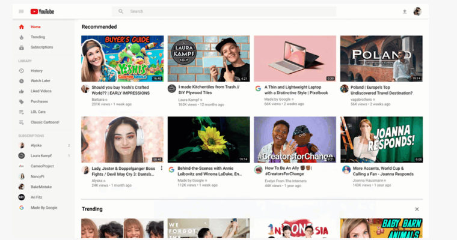

# How to upload to Youtube
## New to the site? Here is how to upload a video!
1. If you have not done so already, you must create a channel. You can do this by signing into [Youtube](https://www.youtube.com/) by using your Google Account.
2. Once you are signed in, on the homepage, there will be an icon that looks like a **camera with a plus inside**. Click on this and then click **"Upload video"**
3. Find where the video is stored on your computer.
4. Give your video a **title.** If your looking to get views, make sure the title is something that will grab someones attention and make them want to check your video out, similar to how you would give an essay a good title to grab their attention.
5. Optionally (but highly recommended), you can give your video a **description**. Simply tell what your video is and what it's about, and give any context that could prove useful to someone watching it.
6. Choose a **thumbnail** for your video. A thumbnail is the picture that people will see next to your video before they click on it. Like the title, make the thumbnail eye-catching so it will make someone want to click on your video.
7. If you want you can add your video to a **playlist**. A playlist is used to organize videos however you please.
8. Set if your video is **made for kids or not**. If you do set it for kids, there will be no ads.
9. Set the **tags** for your video. Tags are basically keywords that can help your video be found.
10. Set if your video is **public or private**. If it is private, only you can view it.
11. Hit **save**, and your video will upload!

[Home](README.md)
[Information about Youtube](YoutubeInfo.md)
